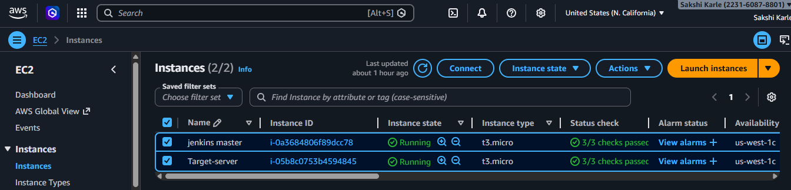
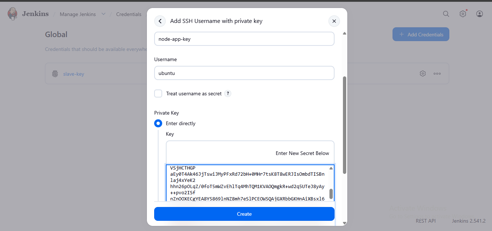
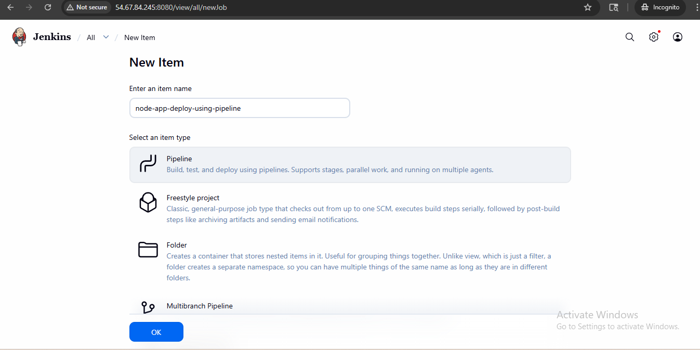
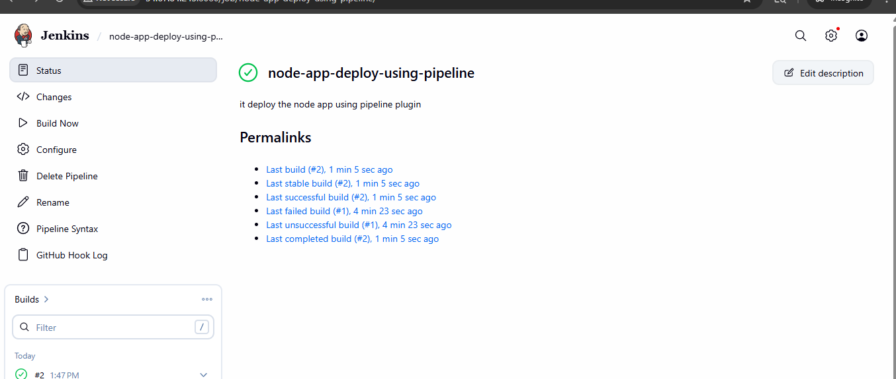
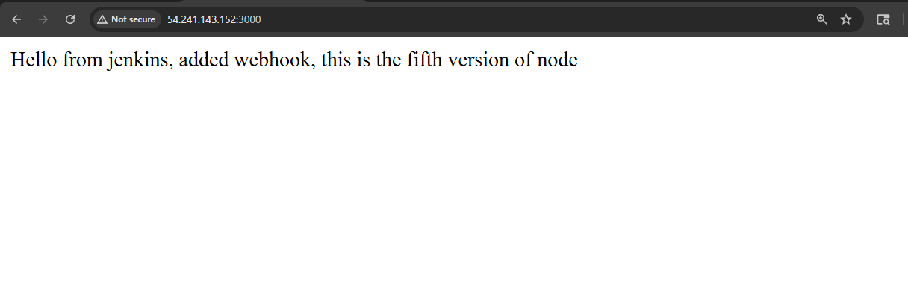
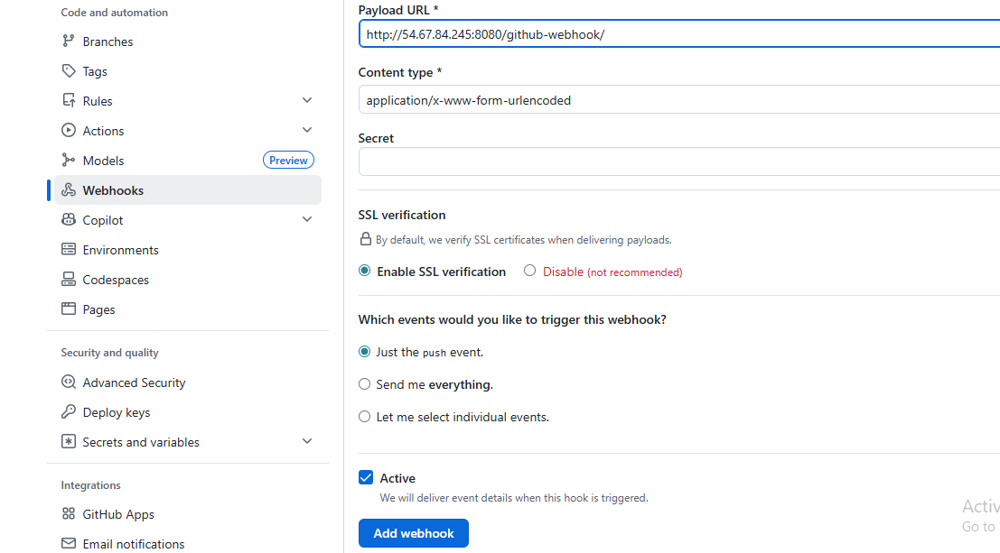
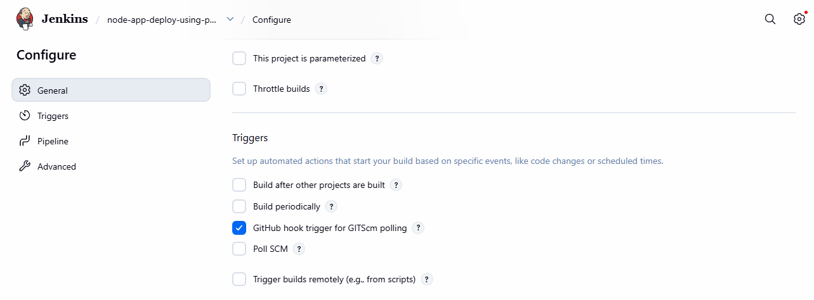

# Node.js CI/CD Pipeline using Jenkins

## 📌 Project Overview

This project demonstrates a complete CI/CD pipeline for a Node.js application using a 2-server architecture:

🟢 Jenkins Server (CI/CD automation)

🔵 Target Server (Application deployment)

The pipeline is triggered automatically using GitHub Webhooks and deploys the application on every code push.

## Architecture

GitHub → Webhook → Jenkins Server → SSH → Target Server → Node.js App (PM2)

## 🛠️ Tech Stack
* Node.js
* Jenkins
* GitHu
* PM2
* AWS EC2

## Step 1: Create GitHub Repository

* Create a repository on GitHub:

node-js-app-CICD

  ## Step 2: Connect Local Project to GitHub

  ### Existing Project
git clone <old-repo-url>

cd repo-name

git remote remove origin

git remote add origin https://
github.com/your-username/node-js-app-CICD.git

git push -u origin main

## Step 3: Launch Server

* Jenkins Server
  * Ubuntu 22.04
  * Open ports: 22, 8080

* Target Server
  *  Ubuntu 22.04
  *  Open ports: 22, 3000
  

  
## Step 4: Setup Jenkins Server

**Install jenkins:**

     sudo apt update 

     sudo apt install openjdk-11-jdk -y 

     sudo apt install jenkins -y 

     sudo systemctl start jenkins 

     sudo systemctl enable jenkins

**Access jenkins:**

     http://<jenkins-ip>:8080

**Install plugins:**

Pipeline

GitHub Integration

## Step 5: Setup Target Server

    sudo apt update
    sudo apt install nodejs npm -y
    sudo npm install -g pm2

## Step 6: Add Credentials in Jenkins

Go to:
Manage Jenkins → Credentials → Global → Add Credentials

* Kind: SSH Username with private key
* Username: ubuntu
* Private Key: (paste key)
* ID: node-app-key
  

## Step 7: Create Jenkins Pipeline Job

1. New Item → deploy-nodeapp
2. Select Pipeline
   

3. Add description
4. Add GitHub repo URL
   
## Step 8: Jenkinsfile
    pipeline {
    agent any

    environment {
        SERVER_IP      = '172.31.4.133'
        SSH_CREDENTIAL = 'node-app-key'
        REPO_URL       = 'https://github.com/Sakshikarle15/node-js-app-CICD.git'
        BRANCH         = 'main'
        REMOTE_USER    = 'ubuntu'
        REMOTE_PATH    = '/home/ubuntu/node-app'
    }
    
    
    stages {
        stage('Clone Repository') {
            steps {
                git branch: "${BRANCH}", url: "${REPO_URL}"
            }
        }

        stage('Upload Files to target-server') {
            steps {
                sshagent([SSH_CREDENTIAL]) {
                    sh """
                        ssh -o StrictHostKeyChecking=no ${REMOTE_USER}@${SERVER_IP} 'mkdir -p ${REMOTE_PATH}'
                        scp -o StrictHostKeyChecking=no -r * ${REMOTE_USER}@${SERVER_IP}:${REMOTE_PATH}/
                    """
                }
            }
        }

        stage('Install Dependencies & Start App on the target server') {
            steps {
                sshagent([SSH_CREDENTIAL]) {
                    sh """
                        ssh -o StrictHostKeyChecking=no ${REMOTE_USER}@${SERVER_IP} '
                            cd ${REMOTE_PATH} &&
                            npm install &&
                            pm2 start app.js --name node-app || pm2 restart node-app
                        '
                    """
                }
            }
        }
    }

    post {
        success {
            echo '✅ Application deployed successfully!'
        }
        failure {
            echo '❌ Deployment failed.'
        }
    }
    }
### Tested pipeline manually first  (Before added webhook)

##    Step 9: Configure Webhook

Go to GitHub → Settings → Webhooks → Add Webhook

    http://<jenkins-ip>:8080/github-webhook/

* Content type: application/json
* Event: Just push

## Step 10: Enable Trigger in Jenkins

✔ Select:

GitHub hook trigger for GITScm polling

## Step 11: Test CI/CD Pipeline

Make changes in app.js:

res.send ("Hello from jenkins, added webhook, we are from 14 july batch");

Push code:

    git add .
    git commit -m "nodeapp added"
    git push origin main

## Result:

* GitHub webhook triggers Jenkins
* Jenkins executes pipeline
* Code deployed to target server
* Application restarted using PM2
  
## Access Application

    http://<target-server-ip>:3000
### Automated pipeline using webhook

## Features
* Automated CI/CD pipeline
* Webhook-based trigger
* Secure SSH deployment
* Zero manual deployment
* Real-time updates

## Conclusion

This project demonstrates real-world CI/CD implementation using Jenkins, GitHub, and a target server with automated deployment.

Thank you for exploring this project.!!